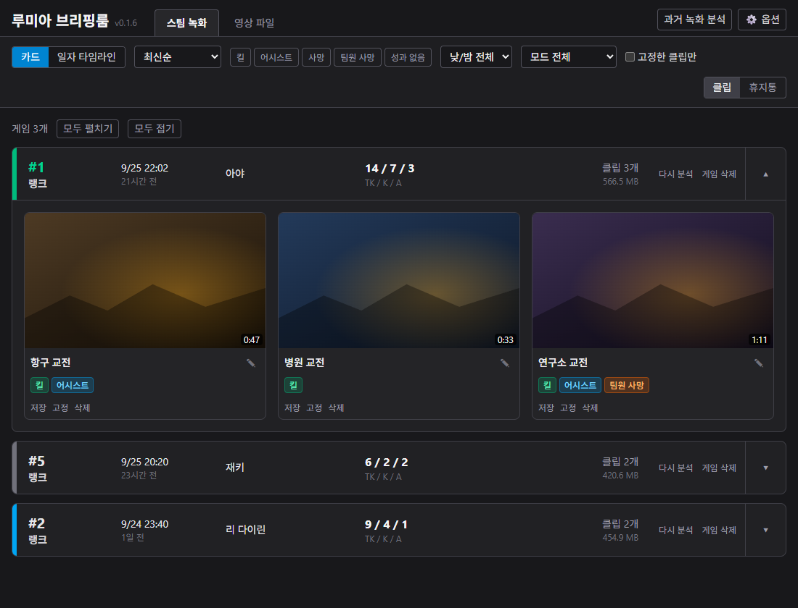
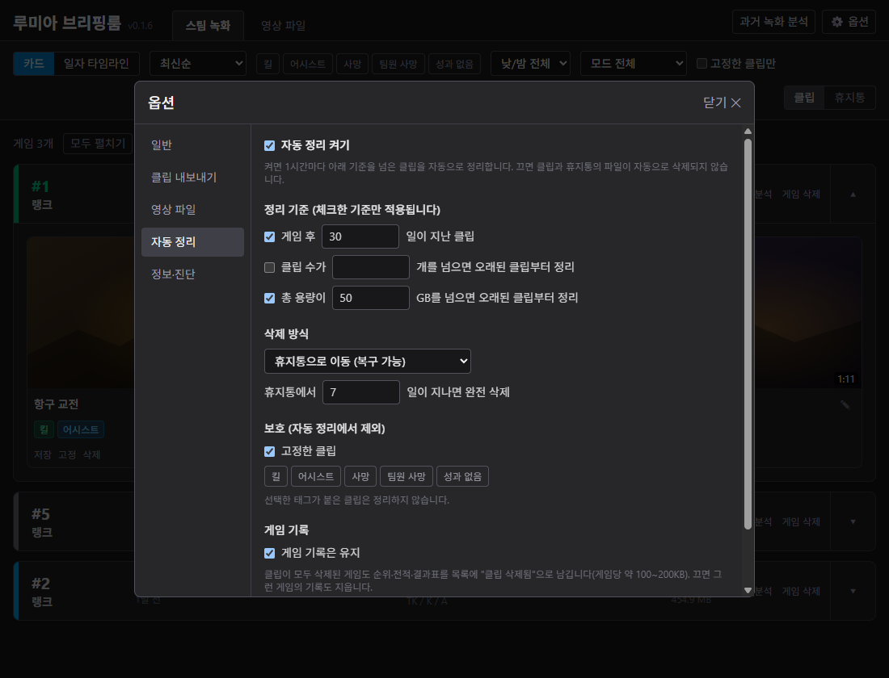
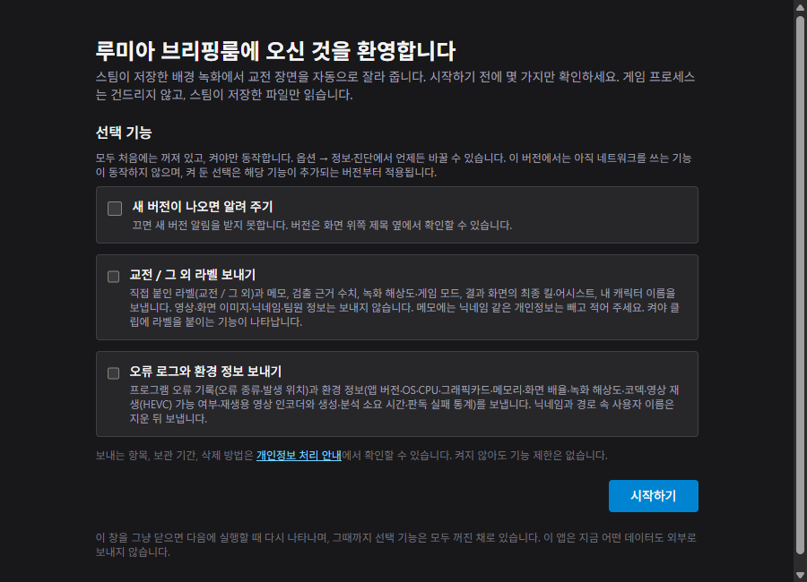
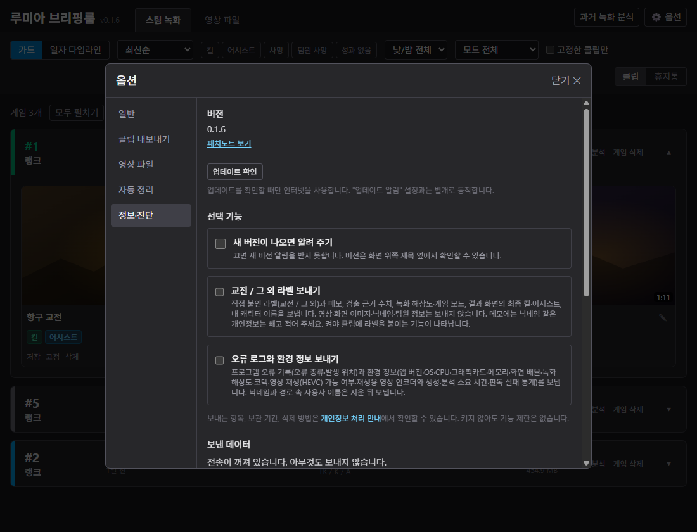

# 루미아 브리핑룸 (Lumia Briefing Room)

이터널 리턴 **교전 클립 자동 추출기**입니다. **스팀 녹화**나 **영상 파일**에서 킬·어시스트·데스가 있는 교전 장면만 자동으로 잘라 주고, 열람 화면에서 바로 볼 수 있습니다.

> **비공식 팬 제작 도구입니다. 이터널 리턴의 개발·운영사 님블뉴런과 무관하며, 님블뉴런의 승인이나 후원을 받지 않았습니다.**
> 이터널 리턴과 관련된 이름·상표·게임 화면의 권리는 각 권리자에게 있습니다.

| | 방법 1 · 자동 | 방법 2 · 직접 추가 |
|---|---|---|
| 입력 | **스팀 녹화** | **영상 파일** |
| 동작 | 게임이 끝나면 알아서 분석해 클립을 만듭니다. | **몇 시간짜리 긴 영상**에서도 교전 구간만 뽑아 줍니다. |

Windows 전용 · 무료 · 소스 공개(MIT)

## 바로가기

[소개](#소개) · [주요 기능](#주요-기능) · [설치와 사용](#설치와-사용) · [지원 환경과 설정](#지원-환경과-설정) · [데이터 수집](#데이터-수집) · [문제가 생겼을 때](#문제가-생겼을-때) · [Windows Defender가 탐지할 때](#windows-defender가-탐지할-때)

## 소개

- **게임을 건드리지 않습니다.** 게임 프로세스·메모리·입력·네트워크에 손대지 않고, **스팀이 이미 저장한 녹화 파일(또는 사용자가 넣은 영상 파일)만 읽습니다.** 안티치트와 무관하게 동작합니다.
- **내 PC 안에서 동작합니다.** 검출·클립 생성·열람은 인터넷 없이 됩니다. 네트워크는 사용자가 직접 켠 부가 기능(업데이트 알림, 라벨·오류 로그 전송, 진단 정보 보내기)에만 쓰고, 기본은 전부 꺼져 있습니다. 영상·썸네일·화면 이미지는 어떤 경우에도 보내지 않습니다.
- **무료이고 소스가 공개**돼 있습니다. 무엇을 보내는지, 얼마나 보관하는지, 삭제하는 법은 **[개인정보 처리 안내](docs/privacy.md)** 에 있습니다.

## 주요 기능

- **자동 클립 생성** — 게임이 끝날 때마다 알아서 분석해 교전 구간을 클립으로 만듭니다(게임 하나에 2~6분).
- **태그와 필터** — 클립마다 킬·어시스트·데스 태그가 붙고, 게임 한 줄에 순위·캐릭터·K/A와 지역 이름이 표시됩니다. 목록에서 태그로 걸러 볼 수 있습니다.
- **영상 파일 탭** — OBS 같은 녹화 프로그램으로 찍은 영상 파일을 넣으면 스팀 녹화와 같은 방식으로 교전만 뽑아 줍니다. 몇 시간짜리 긴 영상도 됩니다.
- **자르기와 내보내기** — 클립의 앞뒤를 다듬고, 원하는 폴더에 파일 이름을 정해 내보낼 수 있습니다.
- **자동 정리** — 기간·용량 기준을 넘은 클립을 정리합니다. 휴지통으로 보내 복구할 수 있고, 고정한 클립은 지우지 않습니다.

## 설치와 사용

1. **스팀 백그라운드 녹화 켜기** — 스팀 → 설정 → **게임 녹화** → **백그라운드 녹화**를 켭니다. 녹화 시간(버퍼)은 **2시간 이상**을 권합니다. 짧으면 게임이 끝나기 전에 앞부분이 지워져 클립을 만들 수 없습니다.
2. **설치 파일 받아 실행** — 이 저장소의 [**Releases**](https://github.com/NCookies/lumia-briefing-room/releases/latest) 최신 버전에서 `LumiaBriefingRoom-x.y.z-setup.exe`를 받아 실행합니다. 같이 올라온 `.sha256` 파일의 값과 받은 파일의 SHA-256이 같은지 확인할 수 있습니다. **관리자 권한은 묻지 않고**, 내 계정 폴더(`%LOCALAPPDATA%\Programs\LumiaBriefingRoom`)에만 설치됩니다. 설치에 약 400MB가 필요합니다.
3. **첫 실행 화면 확인** — 스팀 녹화 폴더와 해상도를 자동으로 찾아 보여 줍니다. 폴더를 못 찾았다면 **직접 고르기**로 `video` 폴더를 선택하고 **시작하기**를 누릅니다.
4. **이터널 리턴 한 판 하기** — 설치가 끝나면 프로그램이 작업표시줄 오른쪽 아래(시계 옆)에 **파란 원 안에 재생 삼각형이 있는 아이콘**으로 떠 있습니다. 안 보이면 그 옆 **∧ 모양 버튼**(숨겨진 아이콘 표시)을 눌러 보세요. 게임을 끝내고 로비로 나오면 알아서 분석을 시작합니다.
5. **클립 보기** — 아이콘을 눌러(또는 오른쪽 클릭) **루미아 브리핑룸 열기**를 누르면 열람 화면이 브라우저로 열립니다.

> **주의 · 파란 경고창** — 설치할 때 **Windows의 PC 보호**(SmartScreen) 경고가 뜹니다. 개인이 만든 프로그램이라 코드 서명 인증서가 없어서 그렇습니다. **추가 정보 → 실행**을 누르면 진행됩니다. 백신이 오탐할 수 있으며, 릴리스 페이지에 파일 해시(SHA-256)와 VirusTotal 검사 결과 링크가 올라옵니다. Windows Defender가 설치 파일을 탐지하는 경우의 대처법은 [아래](#windows-defender가-탐지할-때)에 있습니다.

영상 파일에서 뽑으려면 **옵션(⚙) → 영상 파일**에서 영상 파일이나 영상이 든 폴더를 추가한 뒤, 열람 화면의 **영상 파일** 탭에서 영상 행의 **분석 시작**을 누릅니다. 진행 막대가 보이고, 취소하면 다음에 이어서 합니다.

### 업데이트와 제거

- **옵션 → 정보·진단 → "업데이트 확인"** 을 누르면 새 버전이 있는지 확인하고, 있으면 **"업데이트"** 로 바로 설치합니다. 업데이트를 확인할 때만 인터넷을 쓰며, "업데이트 알림" 설정과는 상관없이 동작합니다.
- **"업데이트 알림"을 켜 두면** 앱이 하루 한 번 새 버전을 확인해 트레이 알림과 화면 위 배너로 알려 줍니다(기본은 꺼짐). 직접 "업데이트 확인"을 눌러 새 버전을 찾은 경우에도 화면 위에 배너가 뜹니다.
- 받은 설치기는 릴리스에 올라온 `.sha256` 값과 SHA-256이 같을 때만 실행합니다. 업데이트가 끝나면 앱이 다시 실행되고 설정·클립은 그대로 남습니다.
- 제거는 Windows 설정의 앱 목록에서 합니다. **클립 폴더는 지우지 않습니다**(기본 위치: 내 비디오\LumiaBriefingRoom).

## 지원 환경과 설정

<b>지원 해상도</b>

| 스팀 녹화 해상도 | 상태 |
|---|---|
| 2560x1440 | 측정해서 지원합니다(가장 정확합니다) |
| 1920x1080 | 측정한 프로필이 있습니다 |
| 그 밖의 16:9 (3840x2160 등) | 측정한 해상도를 비율에 맞춰 조정해 대응합니다. 판독이 틀리면 알려 주세요 |
| 16:9 가 아닌 화면(울트라와이드 등) | 클립은 만들어지지만 K/A·지역명 판독이 틀릴 수 있습니다 |

게임의 UI 크기를 기본값이 아니게 바꾸면 판독이 틀릴 수 있습니다.

<b>설정 항목</b>

화면 오른쪽 위 **⚙ 옵션**에서 바꿉니다.

- **일반** — Windows 시작 시 자동 실행, 스팀 녹화 폴더, 클립 저장 폴더 변경
- **클립 내보내기** — 내보내기 관련 설정
- **영상 파일** — 영상 파일 탭 관련 설정(영상 경로, 클립 저장 폴더)
- **자동 정리** — 정리 켜기/끄기, 게임 후 N일 경과·용량 상한 같은 기준, 휴지통 이동 또는 즉시 삭제, 고정한 클립 보호
- **정보·진단** — 버전과 패치노트, 업데이트 확인·알림, 데이터 전송 켜기/끄기, 진단 정보 보내기, 보낸 데이터 삭제 요청

버전마다 달라진 점은 앱의 옵션 → **정보·진단** → 버전 옆 **패치노트 보기**에서, 또는 [CHANGELOG.md](CHANGELOG.md) 와 각 Release 본문에서 볼 수 있습니다.

## 데이터 수집

이 프로그램은 **화면 인식**으로 킬·어시스트, 지역, 교전 여부를 읽어 냅니다. 그런데 게임 화면은 해상도·모니터·UI 설정에 따라 조금씩 다르게 보여서, **다양한 PC에서 나온 데이터가 많을수록 판독 정확도가 올라갑니다.** 그래서 원하는 분에 한해 아래 세 가지를 보낼 수 있게 했습니다.

> **기본은 전부 꺼짐.** 첫 실행 화면이나 옵션에서 **직접 켠 항목만** 보냅니다. 켜지 않아도 기능 제한은 없습니다.

| 항목 | 보내는 내용 |
|---|---|
| **교전 / 그 외 라벨** | 직접 붙인 라벨과 메모, 검출 근거 수치, 녹화 해상도·게임 모드, 결과 화면의 최종 킬·어시스트, 내 캐릭터 이름. 메모는 그대로 전송되니 닉네임 같은 정보는 적지 마세요. 켜야 클립에 라벨을 붙이는 기능이 나타납니다. |
| **오류 로그와 환경 정보** | 프로그램 오류 기록, 앱 버전, OS, CPU·그래픽카드·메모리, 녹화 해상도·코덱, 판독 실패 통계. 닉네임과 경로 속 사용자 이름은 지운 뒤 보냅니다. |
| **진단 정보** (버튼을 누른 그 순간에만) | 문제가 생겼을 때 직접 눌러 한 번만 보냅니다. 보낼 내용을 먼저 미리 볼 수 있습니다. |

**보내지 않는 것** — **영상, 썸네일, 결과표 이미지, 화면 조각**은 어떤 경우에도 보내지 않습니다. 닉네임, 팀원 정보, 클립 제목, 파일 경로 원문, 스팀·게임 계정 정보도 보내지 않습니다.

**끄는 방법** — 옵션(⚙) → **정보·진단** 탭에서 항목별로 끌 수 있습니다. 이미 보낸 데이터는 같은 탭의 **보낸 데이터 삭제 요청**을 누르면 서버에서 모두 삭제되고 전송도 꺼집니다.

**보관과 보안** — 오류 로그·진단 정보는 받은 뒤 90일이 지나면 자동 삭제됩니다. 서버는 국내(OCI 춘천)에 있고 HTTPS로만 받으며, 접속 IP는 로그로 저장하지 않습니다. 자세한 내용은 [개인정보 처리 안내](docs/privacy.md)에 있습니다.

## 문제가 생겼을 때

<b>클립이 하나도 안 생겨요</b>

스팀 백그라운드 녹화가 켜져 있는지, 게임을 끝까지 하고 로비로 나왔는지, 아이콘을 오른쪽 클릭했을 때 나오는 메뉴의 "감시 중"에 체크가 있는지 확인해 주세요.

<b>클립이 검게 나오고 소리만 나요</b>

PC에 HEVC 코덱이 없을 때 나타납니다. 보통은 재생용 영상(H.264)을 자동으로 만들어 재생합니다. 그래도 검다면 아래 진단 정보를 보내 주세요.

<b>게임이 렉 걸리지 않나요?</b>

분석은 낮은 우선순위로 돌지만 게임 직후 2~6분 동안 CPU를 씁니다. 렉이 느껴지면 알려 주세요.

<b>용량이 걱정돼요</b>

클립은 게임마다 수백 MB씩 쌓입니다. 옵션 → 자동 정리에서 기간·용량 상한을 켜 두세요.

**문제를 알리려면** — 옵션(⚙) → **정보·진단** 탭의 **진단 정보 보내기** 를 누르면 개인정보를 지운 오류 기록·PC 사양을 미리 보여 주고, 확인하면 한 번만 보내 **접수 번호**를 알려 줍니다. 서버로 못 보내면 같은 탭의 zip 저장 버튼으로 파일을 받아 이슈에 첨부해 주세요. 이슈는 이 저장소의 [Issues](https://github.com/NCookies/lumia-briefing-room/issues)에 남기거나 아래 이메일로 보내 주세요.

## Windows Defender가 탐지할 때

설치하거나 실행할 때 Windows Defender(Windows 보안)가 `Trojan:Win32/Wacatac.C!ml` 같은 이름의 **심각** 위협으로 탐지해 파일을 격리할 수 있습니다. 설치 중이라면 `Unable to execute file ... CreateProcess failed; code 225` 오류창이 뜨기도 합니다. 저도 직접 겪었습니다. 놀라실 수 있어서 미리 적어 둡니다.

**이 프로그램은 악성코드가 아닙니다**

- [VirusTotal](https://www.virustotal.com)의 여러 백신 엔진 검사를 통과했습니다(v0.1.5 확인). 릴리스마다 자동으로 검사하고, 결과 링크가 릴리스 페이지에 올라옵니다.
- **소스 코드가 전부 공개**되어 있고, 배포 파일은 공개된 코드를 GitHub에서 자동으로 빌드한 것입니다. 직접 읽어 보거나 빌드할 수 있습니다(아래 "직접 빌드하려면").
- 릴리스 페이지의 SHA-256 값과 받은 파일의 해시가 같은지 비교해 변조 여부를 확인할 수 있습니다.

**왜 탐지되는 걸까요?** 정확한 이유는 Defender가 알려 주지 않아 추측입니다. 이름 끝의 `!ml`은 특정 악성코드와 일치했다는 뜻이 아니라, **머신러닝이 "악성 프로그램과 비슷해 보인다"고 추정**했다는 표시입니다. 이 프로그램은 다음처럼 악성 프로그램과 겹치는 동작이 있습니다.

- 백그라운드에서 계속 실행되며 스팀 녹화 폴더를 감시합니다.
- Windows 시작 시 자동으로 실행되도록 등록할 수 있습니다.
- 영상 처리를 위해 다른 프로그램(ffmpeg)을 실행하고, 새 버전을 받아 설치기를 실행합니다.
- 개인 개발자라 **코드 서명 인증서가 없고**, 아직 사용하는 사람이 적은 새 파일입니다.

이 조합 때문에 Windows가 의심하는 것으로 보고 있으며, 사용자가 늘고 코드 서명을 받게 되면 줄어들 것으로 예상합니다. 코드 서명 방법은 알아보고 있습니다.

**탐지됐을 때 허용하는 방법** — 코드를 직접 확인했거나 위 근거로 판단이 서신다면 다음과 같이 진행하세요.

1. 작업표시줄 → **Windows 보안** → **바이러스 및 위협 방지** → **보호 기록**을 엽니다.
2. 탐지된 항목(루미아 브리핑룸 관련)을 눌러 펼친 뒤, 작업 옵션에서 **"디바이스에서 허용"** 을 고르고 **작업 시작**을 누릅니다.
3. 설치가 중간에 실패했다면 **설치 파일을 다시 실행**합니다. 허용이 적용되기까지 잠시 걸려 바로는 같은 오류가 날 수 있으니, 몇 분 뒤 다시 시도해 보세요.

격리 후 **제거**를 눌렀다면 복원하거나, 새로 받은 설치 파일로 다시 설치하면 됩니다. 설정과 클립은 그대로 남습니다. 믿기 어렵거나 찜찜하시면 설치하지 않으셔도 됩니다. 의심스러운 점은 언제든 [Issues](https://github.com/NCookies/lumia-briefing-room/issues)로 물어봐 주세요.

## 직접 빌드하려면

소스에서 실행·빌드·테스트하는 방법은 **[docs/DEVELOPMENT.md](docs/DEVELOPMENT.md)** 에 있습니다. 배포본은 가상환경을 만든 뒤 `python tools/fetch_ffmpeg.py`(최초 1회)와 `.\build.bat`로 만들 수 있습니다(자세한 순서는 "10. 배포본 빌드").

## 삭제·시정 요청과 연락처

이 프로그램에서 만든 데이터에 관한 삭제 요청, 또는 저작권·상표 등 권리자의 시정·삭제 요청은
**lumia.briefingroom@gmail.com** 으로 보내 주세요. 확인하는 대로 처리합니다.

## 라이선스

- 이 저장소의 소스 코드는 [MIT 라이선스](LICENSE) 입니다.
- 배포본에 포함된 FFmpeg(LGPL)·pystray(LGPL v3)·OCR 모델 등 제3자 구성 요소는 [THIRD_PARTY_NOTICES.md](THIRD_PARTY_NOTICES.md) 를 보세요.
- 이터널 리턴의 게임 화면·로고·이미지는 이 저장소에 포함하지 않으며 앱 아이콘도 직접 그린 것입니다. 이 문서의 스크린샷은 가짜 데이터로 만든 앱 화면입니다.
